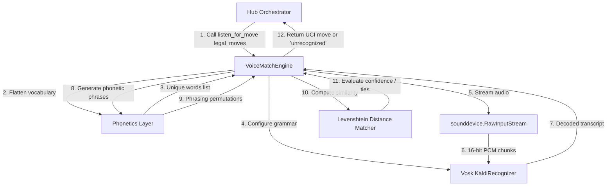

# Voice Chess: Voice & Phonetic Matching (Role 1)

This repository contains the offline **Voice & Phonetic Matching** module (designated as **Role 1**) for a voice-controlled chess robot running on a Raspberry Pi 5. 

It initializes local microphone capture, dynamically builds a restricted speech-to-text grammar based on the current legal moves, and uses phonetic spelling permutations combined with fuzzy string matching to reliably recognize the player's spoken move.

---

## Architecture & System Context

The chess robot operates via a central single-process **Hub Orchestrator**. Role 1 is designed as an isolated, stateless subsystem within this architecture.



### Execution Lifecycle
1. **Move Request**: The central Hub Orchestrator queries the chess engine for all valid chess moves in Universal Chess Interface (UCI) format.
2. **Invocation**: The Orchestrator calls `listen_for_move(legal_moves: list[str])`.
3. **Stream & Decode**: The module opens the microphone, streams audio into an offline Vosk model initialized with a restricted vocabulary, and stops when a phrase is completed.
4. **Phonetic Matching**: The transcribed text is matched against pre-generated phonetic permutations of the legal moves.
5. **Output**: The module returns either a validated UCI move string or `"unrecognized"`.

---

## Repository Structure

The module is composed of the following files:

*   **[config.py](file:///Users/david/Desktop/Chess/config.py)**: Central configuration for audio parameters (e.g., sample rate, dtype, channels), similarity confidence thresholds, Vosk model directory, and input device selection.
*   **[phonetics.py](file:///Users/david/Desktop/Chess/phonetics.py)**: The phonetic expansion logic. Maps alphanumeric chess moves (e.g., `e2e4`) to phonetic variations (e.g., `"echo two to echo four"`, `"pawn to e4"`) and flattens them to feed the Vosk grammar engine.
*   **[engine.py](file:///Users/david/Desktop/Chess/engine.py)**: The core processing engine. Manages Vosk speech recognition, audio streams via `sounddevice`, and phonetic similarity scoring via `RapidFuzz` Levenshtein distance.
*   **[demo.py](file:///Users/david/Desktop/Chess/demo.py)**: A standalone verification utility to list audio devices and test the microphone recognition loop.
*   **[tests/test_voice.py](file:///Users/david/Desktop/Chess/tests/test_voice.py)**: The automated unit test suite verifying phonetics and engine logic.
*   **[requirements.txt](file:///Users/david/Desktop/Chess/requirements.txt)**: Python package dependencies pinned to exact versions.
*   **[agents.md](file:///Users/david/Desktop/Chess/agents.md)**: High-density system context and constraint specifications for AI assistants.
*   **[changelog.md](file:///Users/david/Desktop/Chess/changelog.md)**: Log of version history and updates.

---

## Setup Guide

### Prerequisites

#### 1. System Packages (PortAudio & Python Development Tools)
The `sounddevice` library requires the **PortAudio** C library to interface with the audio hardware.

*   **macOS** (via [Homebrew](https://brew.sh)):
    ```bash
    brew install portaudio
    ```
*   **Raspberry Pi OS / Debian / Ubuntu**:
    ```bash
    sudo apt-get update
    sudo apt-get install -y libportaudio2 python3-dev python3-venv build-essential
    ```

#### 2. Python Environment
Python **3.10 or higher** is required. 

### Installation

1.  **Clone or navigate to the repository directory**:
    ```bash
    cd /Users/david/Desktop/Chess
    ```

2.  **Create and activate a virtual environment**:
    ```bash
    python3 -m venv venv
    source venv/bin/activate
    ```

3.  **Install dependencies**:
    ```bash
    pip install -r requirements.txt
    ```

---

## Speech Recognition Model Setup

This module requires a local, offline **Vosk model** directory.

For headless environments (such as a Raspberry Pi via SSH), run the following commands to download and set up the recommended model:

```bash
# Download the small English model (ideal for embedded devices / Raspberry Pi 5)
wget https://alphacephei.com/vosk/models/vosk-model-small-en-us-0.15.zip

# Extract the model files
unzip vosk-model-small-en-us-0.15.zip

# Place the extracted directory in the root and rename to 'model'
mv vosk-model-small-en-us-0.15 model

# Clean up the downloaded zip file
rm vosk-model-small-en-us-0.15.zip
```

The resulting directory structure should look like this:
```text
/Users/david/Desktop/Chess/
├── model/
│   ├── am/
│   ├── graph/
│   ├── conf/
│   └── ...
├── config.py
├── engine.py
└── ...
```

> [!NOTE]
> If you wish to store the Vosk model in a custom folder, you can set the `VOSK_MODEL_PATH` environment variable:
> ```bash
> export VOSK_MODEL_PATH="/path/to/your/custom/vosk-model"
> ```

---

## How It Works: Phonetic & Fuzzy Matching

Speech recognition on chess terms can be challenging (e.g., distinguishing letters like `"b"` from `"d"`, or digits like `"2"` from `"too"`/`"to"`). To solve this, the engine applies a robust two-stage matching process:

### 1. Dynamic Vocabulary Graphing
When `listen_for_move` is called, it extracts every unique individual word that could appear in phonetic variants of the **current legal moves list**. This list of words is sent to Vosk to configure a **dynamic, highly restricted grammar**. 

Because Vosk's search space is constrained exclusively to valid moves, it cannot misrecognize a move as an out-of-context word (e.g. transcribing "e2e4" as "eating four").

### 2. Phonetic Phrasing Rules (`phonetics.py`)
Each UCI move is expanded into natural phrasing permutations. For example, `e2e4` generates variants like:
*   `e2 e4`, `e two e four`, `echo two to echo four`
*   `pawn e2 e4`, `pawn to e4`
*   `e2 to e4`

#### Special Rules:
*   **Castling**: Strict override mapping.
    *   `e1g1` or `e8g8` → `["kingside castle", "short castle"]`
    *   `e1c1` or `e8c8` → `["queenside castle", "long castle"]`
    *   *Standard square-to-square transitions are blocked for castling to prevent confusion.*
*   **Promotions**: Handled by adding suffix piece terms.
    *   `e7e8q` → `["e7 e8 queen", "e7 e8 promote queen", "e7 e8 promote to queen", ...]`

### 3. RapidFuzz Levenshtein Similarity
The raw transcript returned by Vosk is compared against every generated phonetic phrase for every legal move.
*   **Levenshtein Normalized Similarity** (range `0.0` to `1.0`) is computed using the `RapidFuzz` library.
*   The move with the highest similarity score is selected.

### 4. Safety Guards
To prevent illegal moves or false activations, the output is rejected and `"unrecognized"` is returned if:
*   **Silence/Noise**: The decoded transcript is empty or only consists of `[unk]` (unknown token).
*   **Confidence Threshold**: The highest similarity score is below `config.CONFIDENCE_THRESHOLD` (default: `0.85`).
*   **Exact Tie**: There is an exact similarity score tie between two or more different legal moves (e.g., transcript is equally similar to `e2e3` and `e2e4`).

---

## API Reference

### Initialization
```python
from engine import VoiceMatchEngine

# Initializes and loads the Vosk Model into memory.
# Do this once during application startup to avoid in-game turn latency.
engine = VoiceMatchEngine()
```

### Recognize Moves
```python
# A list of legal moves in UCI format
legal_moves = ["e2e4", "g1f3", "e1g1", "e7e8q"]

# Capture audio from microphone, decode, and match.
# This call is blocking (timeout: 5.0 seconds).
matched_move = engine.listen_for_move(legal_moves)

print(f"Recognized move: {matched_move}")
# Output: 'e2e4', 'e1g1', or 'unrecognized'
```

---

## Hardware Configuration & Troubleshooting

### 1. Selecting a Specific Microphone
By default, the engine connects to the system's default input device. Raspberry Pi 5 does not have built-in microphones, so you will need to plug in a USB microphone or audio HAT.

To find the correct microphone device index, run:
```bash
python3 demo.py
```
This utility will print a list of all detected PortAudio input devices. Once you identify your microphone's index, set it in `config.py`:
```python
# In config.py:
DEVICE_INDEX: Optional[int] = 2  # Replace with your mic's device index
```

### 2. Sample Rate Mismatch (`PortAudioError: Invalid sample rate`)
Vosk expects a `16000 Hz` mono sample rate. Some cheaper USB microphones only support capturing audio at `44100 Hz` or `48000 Hz`. If you encounter a `PortAudioError: Invalid sample rate` (error -9997), you can tell Linux (ALSA) to handle resampling using a virtual device in `~/.asoundrc`:

Create or edit `~/.asoundrc`:
```text
pcm.usbmic {
    type hw
    card 1     # Replace with your card number from 'aplay -l'
    device 0
}

pcm.resampled {
    type plug
    slave {
        pcm "usbmic"
        rate 16000
        channels 1
    }
}
```
Then select the device index corresponding to `resampled` in `config.py`.

### 3. Apple Silicon macOS Compatibility
If you are developing on an Apple Silicon (M1/M2/M3/M4) Mac and encounter issues resolving `vosk` packages or pre-compiled wheels, ensure you are running a supported python version (Python 3.10 to 3.12 are fully supported by Vosk). If issues persist, you can run terminal commands using Rosetta 2 translation by prefixing commands or running terminal in Intel-emulation mode.

---

## Verification & Testing

### Running the Demo Script
The included `demo.py` script lists all detected devices and runs a live voice capturing session with a predefined set of legal moves:
```bash
python3 demo.py
```

### Running Unit Tests
To run the test suite and verify the logic for phonetics generation and similarity matching, execute:
```bash
PYTHONPATH=. pytest
```
All tests should pass.
